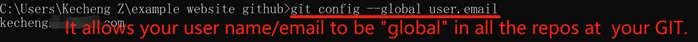

# 2. Project management

This week, Ivan taught us how to use GIT as a version control system to store, modify and recall files in local repository to online repository. After well configured, an individual can easily manage projects alone or invite others to work together in cyber space.  

However, I am 32 years old with no programming knowledge. This was the first time I programmed in real use(not just a standarized homework of "hello world", but seriously for writing documentation of the whole Fablab session). To be honest, it took me some time to realise why this programming was about project management.  

To finish the task, I installed Gitlab (failed to use due to the credit card verification), Github, GitCMD, Python, Mkdocs, all of which are freshly new to me. It means that I had to simultaneously learn and understand those computer sciences tools apart from the programming, the logic of VCS, as well as the non-stop courses from Fablab(all new).  

Also, during COVID, I started everything online remotely, and had to get used to not only the engineering knowledge, but also the entire Fablab logistics and criteria including the communication styles in local Oulu branch.  

Since my initial incentive is to experience maker education ethnographically, I have no face to lose, nor need I do things in a hurry as long as I do not give up. **It is a process of problem solving**.  
 
Thus, I officially started the session with zero knowledge on Jan 11 2022, but returned to construct the documentation on Mar 9, 2022, after 10 weeks of constant practice and exploration via real project managements such as computer-aided design, computer-controlled cutting, intellectual property, electronics productions.  

It is very useful as now I feel more practical and relatable to Ivan and Neil's teaching materials (video, ppt, etc).  

In this regard, I borrowed some of Ivan's ppt pictures for elaboration.   
     
I particularly thank Ivan for the comprehensive introduction of the knowledge as well as his patience, Diep for encouragement, and Antti R for extended Markdown knowledge such as the localhost: 8000.  
 
Things to install when using Github:  

- **CMD (can use Git CMD)**: to run commands   
- **Notepad++**: to write markdown or html syntax  
- **Github (register a personal account)**: to host webpages on VCS  
- **Python**: to run mkdocs   
- **mkdocs**: to transcribe markdown codes to html format  

## Create, modify and host a personal webpage: from VCS to Markdown 

### Stage 1: VCS, GIT, Gitlab & Github  

When people create some files, there will be several verions which are not always ready or perfect, so different audience or cooperators may want to refer to specific versions at certain points, or construct different work paths, respectively. Therefore, it is needed to have an "online bank of files", which is **Version Control System (VCS)**.  

GIT is a fast, user-friendly, flexible VCS to allow users to **record** changes to a file or **recall** previous versions from it as it saves historical logs. Multiple users can thus work cooperatively on the shared files. There are a number of popular VCS while this time we chose GIT as practice.  
   
  

There are also several popular GIT code hosting sites with the same syntax. The biggest difference between Gitlab and Github is that the previous one needs a credit card verification. Unfortunately, I was robbed so had to register a Github account where I must type **mkdocs build** every time manually.  

  

### Stage 2: The creation of a page    

Basic knowledge for absolute beginners:  

First of all, a website is a text document. It is written in **html** syntax to allow **browsers** such as Chrome to read and display. A modern webpage usually consists of three parts:  
 
- **html** is about the content (the uploaded text, pictures, videos) and structure of a webpage, which is shown as **index**.    
- **CSS** is about the styles and design elements (font, colour, size) of a webpage.  
- **Javascript** is about the interactive elements (toggles, pop-up windows, menues) with users.  

Below is my first webpage using html sytanx.  

  

On the other hand, just like academic terms, in computer sciences, there are also many CS words that need to know:  

- **configure**: create, install, establish.  
- **directory**: file.
- **repository**: warehouse, storage, a saving place.  
- **local**: saved in your PC.  
- **remote**: saved online (in VCS).  
- **push**: upload files from local repository to the online repository.  
- **pull**: the reversed flow of push.  
- **deploy**: show, run, display.  

Now, I need to **push** my webpage to Github. In common language, we can say to **post** it online.  

### Stage 3: Use static site generator to construct a personal site, then deploy on Github    

It is crucial to know the learning objectives throughout the process. The goal was not to become a html expert, but to generate a documentation page for project management. So, I'd rather save time of typing codes line by line, but adopt some **templates** (note that you have to be careful of intellectual property issues when you want to "borrow" something).  
 
**Template** saves a lot of time for site builders as the html, CSS, and Javascript contents have been preset. You need to understand the basic logics and syntax of those parts to "fork your own" site by changing details.   

  

In fact, if something can be a template, it must contain certain brilliant ideas. You can right click the mouse on any webpage, or press F12, to open the "backstage" to see how certain codes and syntax effects the display of the text, which is good for active learners.  

  

Now, I needed to push the personal webpage to Github.  

1. Open CMD, type **git config user.name "xxx"**, and **git config user.email "xxx@xxx"** to create a name and email address at GIT repository.  

  

2. type **git config --global user.email "xxx"** to make your username and email the same for all repositories at your GIT.  

  

3. I used Ivan's Fablab student webpage template from his Github page. Copy the url, and type **git clone "the url"**.  

  

4. Go to the downloaded student template file, cut and paste them to personal local repository.  

  

5. Delete 2 unnecesary files: .gitlab-ci.yml and requirements.txt  

  

6. Create a remote repository to "receive" the uploaded files from local repository.  

  

7. Folk my personal information based on the student template.  

  

cut **index.html** and **style.css** to the newly created local repository. Then, go to CMD, do the following 4 steps to push the _docs files (or updates) to remote repository.  

  

Notes on the codes:  

- **git status**: Check if there are updates in the local repository.  
- **git add .**: Agree on the changes to index file. You can also add xxx(specific files, remember to have the "full name.format" typing) to add specific files.   
- **git commit **: commit -m "xxx": Commit the changes in local repository with a note or label.  
- **git push**: Push (uploade) the files or updates from local repository to the online one in GIT.  

In fact, you can type **"git --help"** to find basic commands.  

5. Go to Github remote repository, click Setting - Pages, make sure the Branch to be master. You can see the information of "Your site is published at:....." as the ultimately webpage. It takes some time to refresh so do not worry.  

  

Finally, I can host the personal page through Github.  

  

### Stage 4: The toolbox for webpage modification: Markdown syntax  

Let's have a direct comparision between html and markdown grammars.  

  

  

Apparently, markdown is much easier to learn and use. It does not require users to memorise very detailed syntax, but can pay more attention on the content writing. Of course, if you are an expert in html syntax, or want to debug very specific parts, or write more customised sites, it is rewarding to probe into html.  

### Stage 5: Mkdocs: A great project documentation tool  

In the **_docs** files, a user uses markdown syntax to build up a site. To transfer the contents into html format, you must use **mkdocs** commands.  
  

### The management of local and remote repositories  

### SSH  

SSH can be understood as keys to the GIT servers. Every time if someone (including the original creator) wants to upload or modify something from local repository, the server will check if the keys are matched.  

There are public and private keys. THe public one can be shared to anyone for collaborative work, while the private one should be only stored in local PC.  

You do no create the key on your own, but rather type **ssh-keygen -t rsa -C "your.email@example.com" -b 4096** to create a long chain based on cryptology.  

  

Go to home directory to find .ssh file. the **_id_rsa** is the private key. You can open with a notepad (but don't share).  

  

  

## My personal website and Markdown exploration

