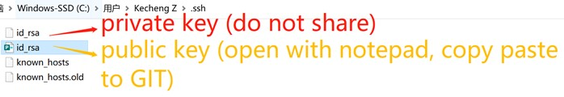
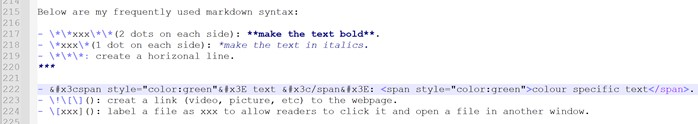

# 2. Project management

This week, Ivan taught us how to use GIT as a version control system to store, modify and recall files in local repository to online repository. After well configured, an individual can easily manage projects alone or invite others to work together in cyber space.  

## Reflection  

I am 32 years old with literally no programming knowledge. This was the first time I programmed in real use(not just a standarized homework of "hello world", but seriously for writing documentation of the whole Fablab session). To be honest, it took me some time to realise why this programming was about project management.  

To finish the task, I installed Gitlab (failed to use due to the credit card verification), Github, GitCMD, Python, Mkdocs, all of which were fresh to me. It means that I had to simultaneously learn and understand those computer sciences tools apart from the programming, the logic of VCS, GIT, the workflow of each command, as well as the non-stop courses from Fablab(all new).  

Also, during COVID, I started everything online, and had to get used to not only the engineering knowledge, but also the entire Fablab logistics and criteria including the communication styles in local Oulu branch.  

Since my initial incentive is to experience maker education ethnographically, I have no face to lose, nor need I do things in a hurry as long as I do not give up. **It is a process of problem solving**.  
 
Thus, I officially began the session with zero knowledge on Jan 11 2022, but returned to construct the documentation on Mar 9, 2022, after 10 weeks of constant practice and exploration via real project managements such as computer-aided design, computer-controlled cutting, intellectual property, electronics productions.  

It is very useful as now I feel more practical and relatable to Ivan and Neil's teaching materials (video, ppt, etc).  

In this regard, I borrowed some of Ivan's ppt pictures for elaboration.   
     
I particularly thank Ivan for his comprehensive introduction of the knowledge as well as patience, Diep for encouragement, and Antti R for extended Markdown knowledge such as the localhost: 8000.  
 
Things to install when using Github:  

- **CMD (can use Git CMD)**: to run commands   
- **Notepad++**: to write markdown or html syntax  
- **Github (register a personal account)**: to host webpages on VCS  
- **Python**: to run mkdocs   
- **mkdocs**: to transcribe markdown codes to html format  

## GIT  

### VCS, GIT, Gitlab & Github  

When people create files, there will be several verions which are not always ready or perfect, while different audience or cooperators may refer specific versions at certain points, or construct different work paths, respectively. Therefore, it is needed to have an "online bank of files", which is **Version Control System (VCS)**.  

GIT is a fast, user-friendly, flexible VCS to allow users to **record** changes to a file, or **recall** previous versions from as it saves historical logs. Multiple users can thus work cooperatively on the shared files. There are a number of popular VCS while this time we chose **GIT** as practice.  
   
  

There are also several popular GIT code hosting sites with the same syntax. The biggest difference between Gitlab and Github is that the previous one needs a credit card verification. Most people prefer to use Gitlab as it supports mkdocs which can **transcribe Markdown into html language remotely**.  

Unfortunately, I was robbed so had to register a Github account where I must type **mkdocs build** every time manually on PC as it does not support mkdocs.  

  

### Creating a page    

Basic knowledge for absolute beginners:  

First of all, a website is a text document. It is written in **html** syntax to allow **browsers** such as Chrome to read and display. A modern webpage usually consists of three parts:  
 
- **html** is about the content (the uploaded text, pictures, videos) and structure of a webpage, which is shown as **index**.    
- **CSS** is about the styles and design elements (font, colour, size) of a webpage.  
- **Javascript** is about the interactive elements (toggles, pop-up windows, menus) with users.  

Below is my first webpage using html sytanx.  

  

On the other hand, just like academic terms, in computer sciences, there are also many CS words that need to know:  

- **configure**: create, install, establish.  
- **directory**: file.
- **repository**: warehouse, storage, a saving place.  
- **local**: saved in your PC.  
- **remote**: saved online (in VCS).  
- **push**: upload files from local repository to the online repository.  
- **pull**: the reversed flow of push.  
- **deploy**: show, run, display.  

Now, I need to **push** my webpage to Github. In common language, we can say to **post** it online.  

### Key commands in GIT  
  
- **git status**: Check if there are updated files in the local repository.  
- **git add .**: Track the updated files and prepare them to be commited. You can also add xxx(specific files, remember to have the "full name.format" typing) to add specific files.   
- **git commit -m "xxx"**: Store the added files to the local repository. "xxx" is a note or label.  
- **git push**: Synchronise the files stored in local repository to remote counterpart. After this step, the locally saved files will be moved to the GIT repository.    

In fact, you can type **"git --help"** to find basic commands.  

  

Antti R taught me a very useful code to preview the webpage locally by typying "**mkdocs serve**" then open a window with the command "**localhost:8000**". Every time I save something on notepad, the localhost will be refreshed immediately to allow checking and proofreading.  

To close it, press **Ctrl + C**. 

## Description of the website    

It is crucial to know the learning objectives throughout the process. The goal was not to become an html expert, but to generate a documentation page for project management. Thus, I did not want to use the "hello world" as my website, but looked for some **templates**.  
  
### Template  
 
**Template** saves plenty of time from scratching the surface of website construction as the html, CSS, and Javascript contents have been preset. You need to understand the basic logics and syntax of those parts to "fork your own" site by changing details.   

  

Bootstrap, Wrap Boostrap, and Start Bootstrap are popular template websites. For Fablab assignment, this time I adopted Ivan's Fablab student template.  

In fact, if something can be a template, it must contain certain brilliant ideas. You can right click the mouse on any webpage, or press F12, to open the "backstage" to see how certain codes and syntax effects the display of the text, which is good for active learners. However, you should pay attention to intellectual property issues when you want to "borrow" something from others' webpage.  

  

Now, I needed to host the personal webpage to Github.  

**Step 1** Open **CMD**, type **git config user.name "xxx"**, and **git config user.email "xxx@xxx"** to create a name and email address at GIT repository.  

  

**Step 2** **git config --global user.email "xxx"** to make your username and email the same for all repositories at your GIT.  

  

### SSH  

SSH can be understood as **keys** to the GIT servers. Every time if someone (including the original creator) wants to upload or modify something from local repository, the server will check if the keys are matched.  

There are public and private keys. The public one can be shared to anyone for collaborative work, while the private one should be only stored in local PC.  

You do no create the key on your own, but rather type **ssh-keygen -t rsa -C "your.email@example.com" -b 4096** to create a long chain based on cryptology.  

  

Go to home directory to find .ssh file. The **_id_rsa** is the private key. You can open it with a notepad (but don't share).  

  

  

  

If you redo the ssh-keygen code, it means that the computer will randomly create a new pair of SSH. If you click y to overwrite the SSH, new public & private keys will replace the \_id_rsa files, so remember to copy & paste the new public key to the GIT.  

Otherwise, your new push will be denied as the public SSH is unmatched.  

  

### Creating the site  

**Step 1**  I used Ivan's Fablab student webpage template from his Github page. I downloaded the compressed zip file from Moodle.  

  

**Step 2** In CMD, I typed "mkdir example website github" to configure my local repository for Github.  

**Step 3** Then, I went to the downloaded student template file, cut and paste all the files to my Github local repository.  

  

I deleted 2 unnecesary files: .gitlab-ci.yml and requirements.txt.  

  

**Step 4** I created a remote repository to "receive" the uploaded files from local repository.  

  
      
Then, in the remote repository, I clicked **Setting - Pages**, made sure the **Branch** to be **master**. You can see the information of "Your site is published at:....." as the ultimately webpage. It takes some time to refresh so do not worry.  

  

**Step 5** Then, I went to CMD, did the following 4 steps to push the files saved at \_docs folder to remote repository.  

  

Finally, I can host the personal page at Github.  

  

**Step 6** Fork my personal information based on the student template.  

To do so, open **mkdocs.yml** at the local repository with notepad++.  **mkdocs.yml** allows me to define the name of the site, the descriptions, social media links, colors, fonts, etc.  

  

In this regard, I practised changing the title, adding a dark mode, the new colour of the webpage for spring, and customizing my social media information.  

  

**Use Markdown to easily write syntax**  

Interestingly, it took me weeks to realise that I had been using **markdown** language rather than html on notepad to modify personal webpage.  

Why markdown is recommended? Let's have a direct comparision between markdown & html grammar.  

  

  

Apparently, markdown is much easier to learn and use. Using plain text, it does not require users to memorise very detailed syntax, but can pay more attention on the content construction. Markdown reads codes from top-down, which is a vertical flow, so it omits the complicated layout setting. Of course, if you are an expert in html syntax, or want to debug very specific parts, or write more customised sites, it is rewarding to probe into html.  

Below are my frequently used markdown syntax:  

- \*\*xxx\*\*(2 dots on each side): **make the text bold**.  
- \*xxx\*(1 dot on each side): *make the text in italics*.  
- \*\*\*: create a horizonal line.  
***  
 
- &#x3cspan style="color:green"&#x3E text &#x3c/span&#x3E: colour specific text.  
- \!\[\](): creat a link (video, picture, etc) to the webpage.  
- \[xxx](): label a file as xxx to allow readers to click it and open a file in another window.  
- \-  : create a bullet.  

In fact, the syntax in notepad is as below. There are two important tips for to **escape** the syntax characters:  

- type \ before the sensitive characters 
- use **hex** for some characters

  

   
Of course, there are many interesting markdown syntax from the cheatsheet worth exploring.(https://cheatography.com/snidd111/cheat-sheets/gitlab-markdown/)  

  

**Step 7** **\_docs → Mkdocs → docs**  

Basically, in this step, I used **Mkdocs** as a **Static Site Generator** to transcribe other computer language, source code, and characters into html that can be deployed as a website. Gitlab can directly execute mkdocs in the serve, whereas Github does not. Therefore, I have to type mkdocs mannually each time.   

After customizing my own information, under Github, I MUST change the **doc** into **_doc**. Then, create an empty file named **doc**.  
 
  
  

In **_docs** folder I store and modify files in different folders, using **markdown** as source code. I put pictures and videos into **images**, and write documentations in **assignments**.  

  
 
In **docs** folder I store the **html** source code built by **mkdocs**. This is page that is deployed and shown ultimately.  
  
  

If I examine the **mkdocs.yml** file, I can see that **docs_dir** represents **\_docs folder**, while **site_dir** for **docs folder**.  
  
   

In the **_docs** files, a user usually employs markdown syntax to upload & modify files to a webpage. To **transcribe the contents into html format** in **docs** file, you must use **mkdocs** commands.  

To realize it, install two things accordingly:  

- Python(Don't be scared)   
 
- MkDocs (type **pip install mkdocs** in CMD to install it. Mkdocs is monitored by Python).  

  
  

So, every time after modifying things in **\_doc**, run the 4 steps (**git status, git add ., git commit -m "xxx", git push)** to store files in **markdown**.  

Then, I should type **mkdocs build** to transcribe markdown into **html** saved in **docs**.  

Finally, redo **git status, git add ., git commit -m "xxx", git push** to synchronize the deployed website remotely.  
 
  

