# 3. Computer Aided design

## Research
To design and study the raster and vector files, this time I tried Inkscape for 2D, and Fusion360 for 3D, both of which were totally new to me. It took me around 10 days to get used to their basic functions, during which I regulated my emotion, motivation, as well as the cognitive strategies to learn them. Professional and scary as they may be, they can be unbelievably convenient once knowing the logic and mechanisms of the complexity behind them.

## Gallery + Elaboration

### 1. 2D Raster and Vector: Inkscape

This is the 2nd pencil draft of the wooden bag for the final project.
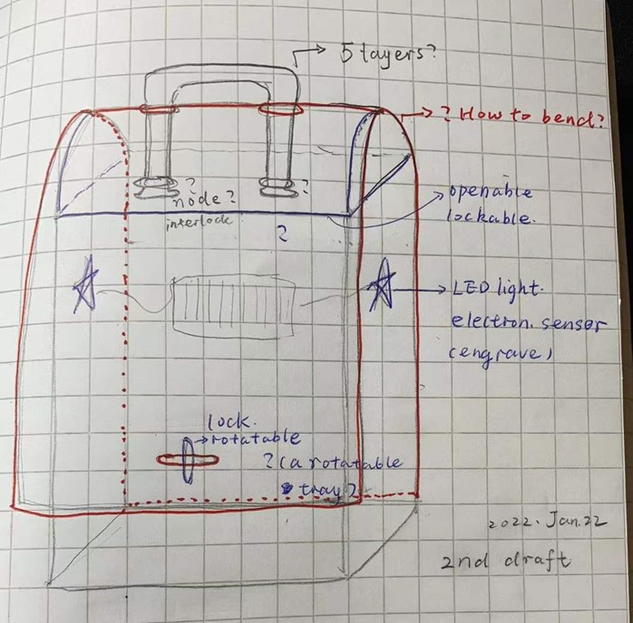

As an amateur, I studied thingiverse.com to get inspirations of the wooden box files with their svg files. 
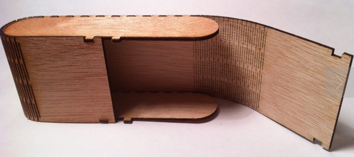
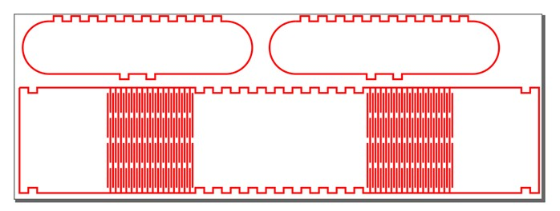

I defined the parts that need modifications such as the flat bottom, interlocking designs, holes to allow the handle, and the trapezoid front-upper side. 
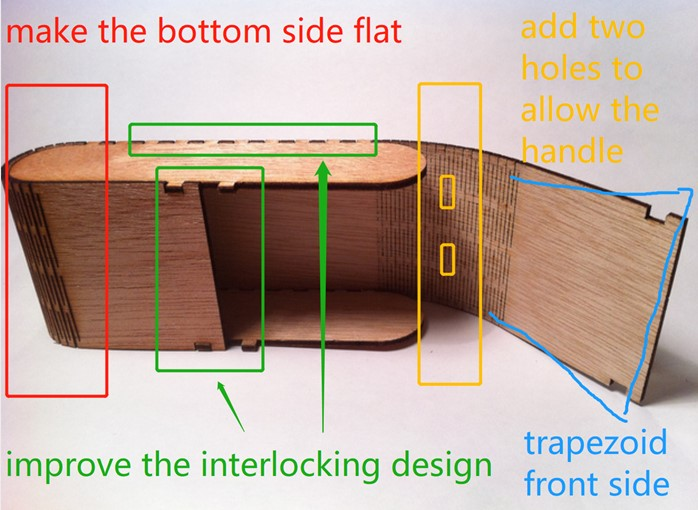

The measurement is crucial in Inkscape design. I got the parameters including slot width and depth.
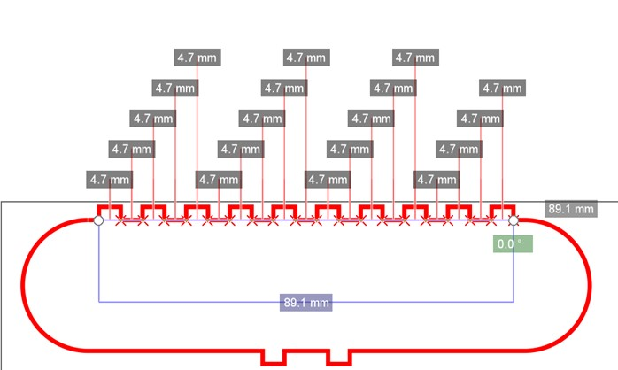
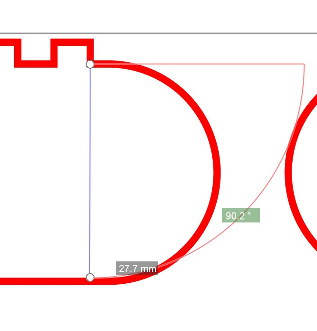

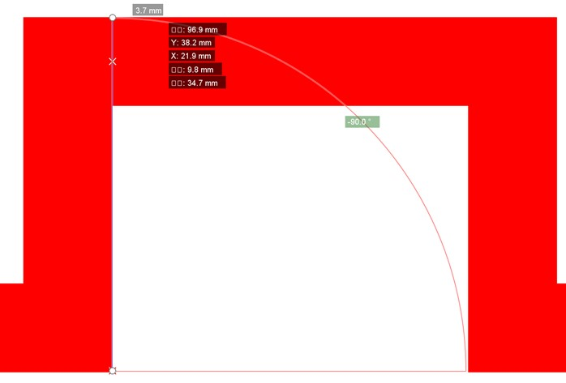

I used eraser function to weed off the unnecessary parts, then closed the side with a straight line. 
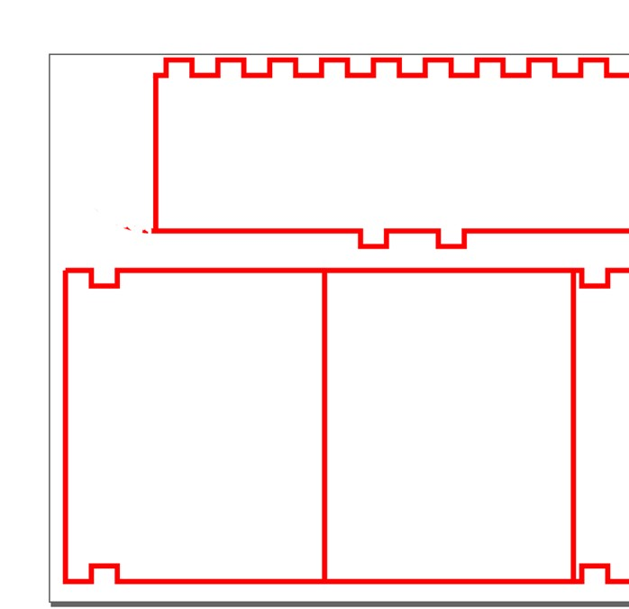

For the residuals, I used white rectangular blocks to cover. 
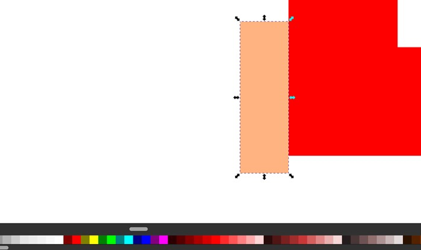

After the trial, I could focus more on the technical parts for the coming laser cutting: the round corners, the bendable top, etc. So, I used the 3rd pencil draft to help illustrate.
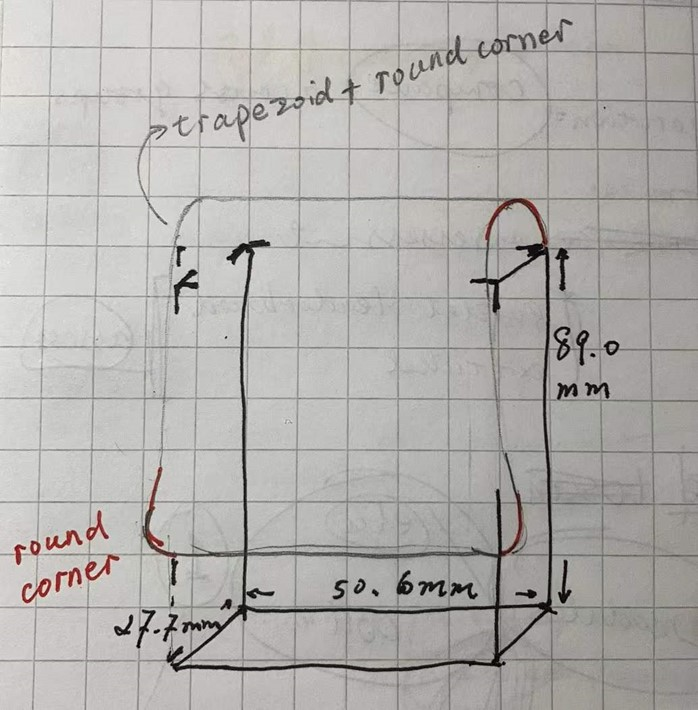

After the modification, I still need to change the line width to 0.02 mm for laser cutting, redesign the trapezoid lines, justify the jigsaw teeth interlocking designs, and take kerf into consideration. 
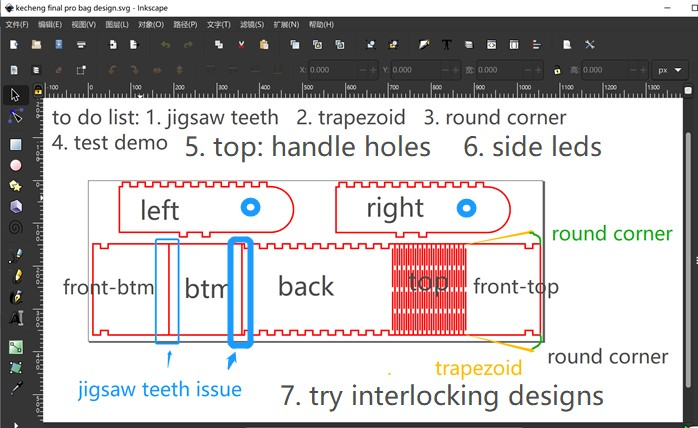

### 2. 3D Raster and Vector: Fusion360 

I met some problems using Fusion360 during the week mostly because I felt hesitant and scared of new software. I was anxious about the functions or unfamiliar keyboard combinations of Fusion360, just like when I started to programme at CMD, or Inkscape, or generally speaking, anything new including some classic RPGs such as Neverwinter Night, the Elder Scroll, etc. or living in a new country. It is more about personality. So, I tried to dodge Fusion360, but when it came to Behnaz's week for computer-controlled cutting, I must face it as Inkscape is smart except for one thing: parametric design!
  Therefore, I returned to this week's task then located the function of learning Fusion360 as to understand and try parametric designs. After hours of nervous attempt, I practised designing a pentagon with sloths. Since this assignment was completed after week 4's content, I had already got the knowledge of kerf, so would directly post the portfolio here.

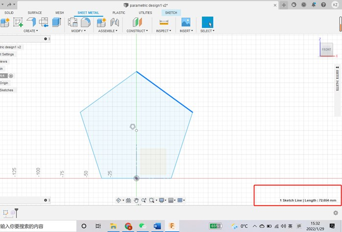
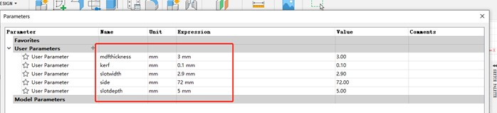
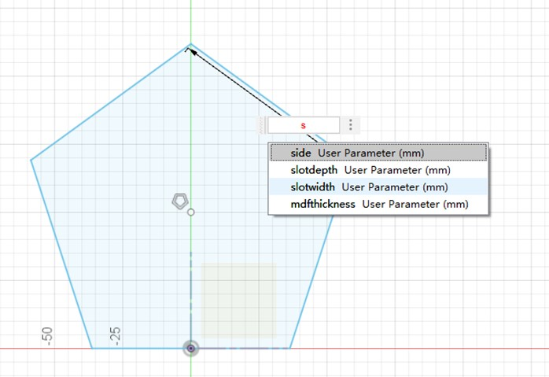
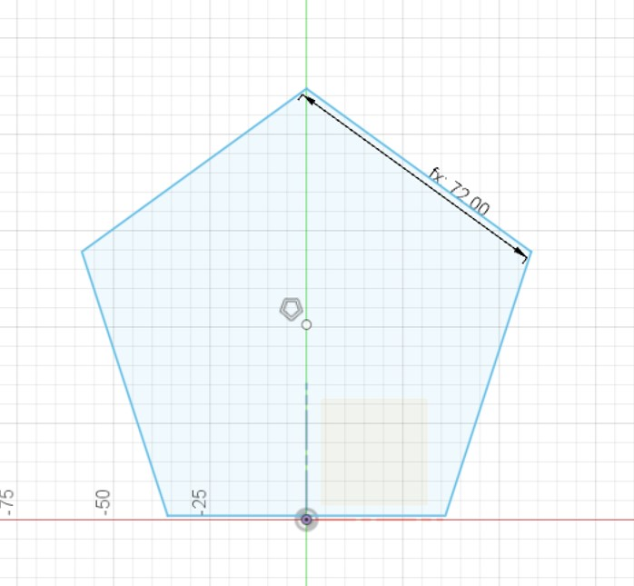
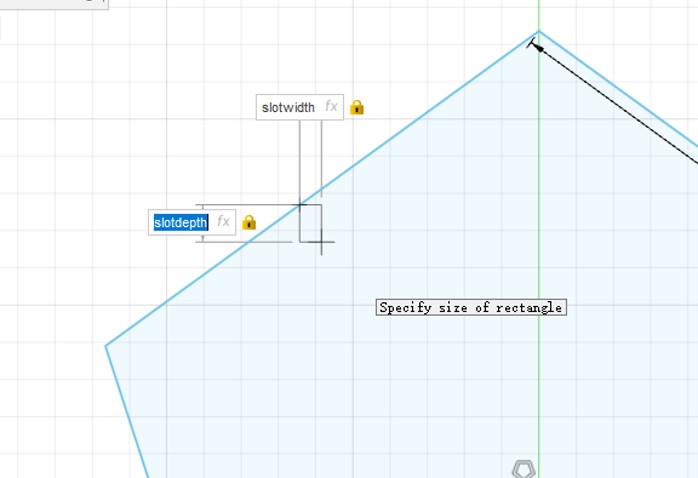
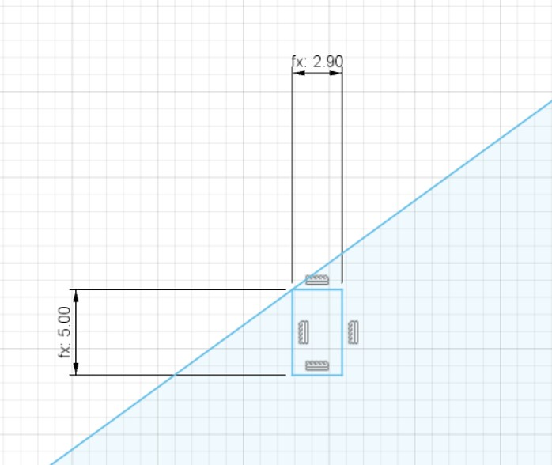
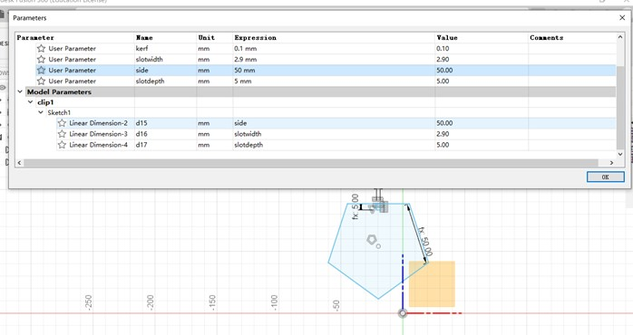
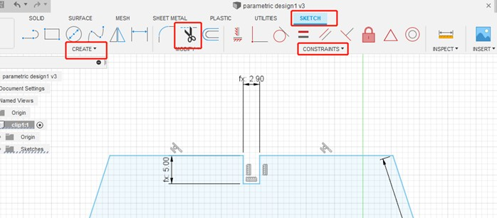
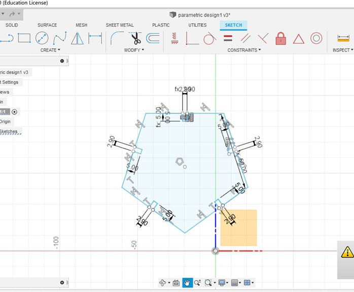
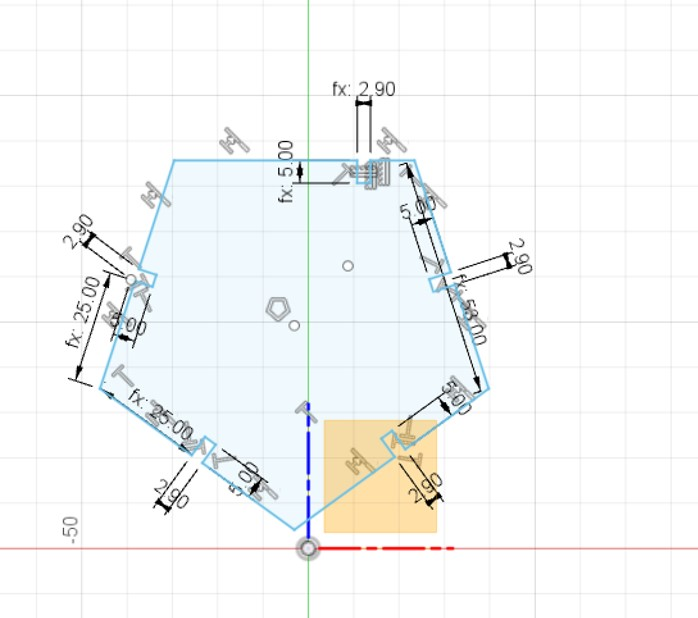
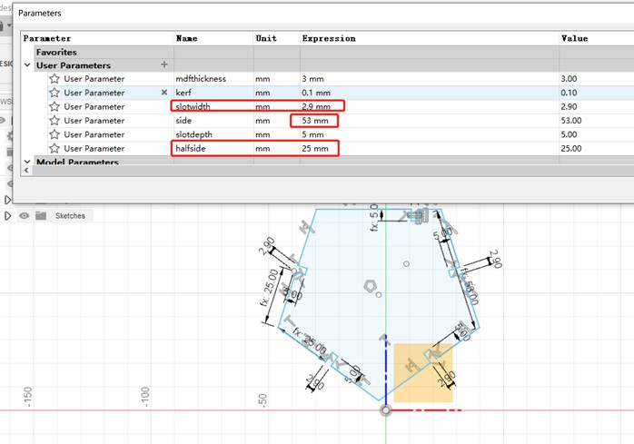
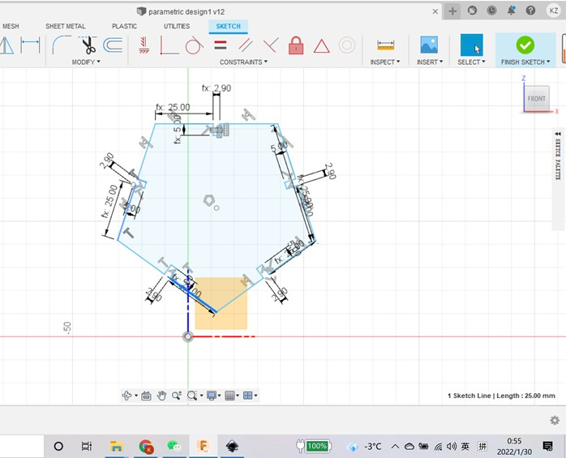

