# 3. Computer Aided Design

This week (In the middle of January) Yrjö gave a lecture on computer aided design. I watched Neil's video, wrote the rusty draft, but seriously returned to the documentation on Mar 6, 2022, after 7 weeks of understanding, practice, and digestion of the knowledge through the experience of computer controlled cutting, PCB design, and observations of other people's work.  

To me, it is like using statistics softwares such as SPSS, Stata, and MetLab: Always learn it under real tasks. 

## Research

The 2 key concepts of this week are:  

- **raster** (位图). Raster graphs are made by square **pixel**s. Pixel is the combination of picture and element, or in common language, a dot. Pixels are often measured in **dpi** (dots per inch), and directly affects the resolution of raster graphics, hence is an elementary concept in printing industry. The higher the dpi is, the "clearer" a picture looks like. **.jpeg**, **.gif** are the most common raster files.   

- **vector** (矢量). Unlike pixel-based raster graphs, vector deploys geometric primitives to draw lines and curves which is independent from resolution and is smaller than raster pictures. Even if you zoom in, it looks as "clear" as the originnal size because the lines are always smooth which makes "resolution" basically not a concrete concept. **.ai**, **.svg** are the most commonly used vector files.  
 
Below is a vivid comparison between raster and vector pictures.  

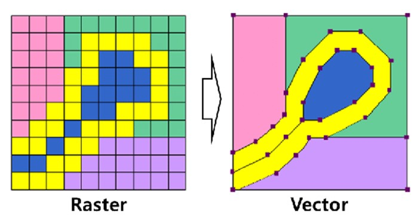

To try the raster and vector designs, I used GIMP for 2D raster, Inkscape for 2D vector, and Fusion360 for 3D models, all of which are new to me.  

Before the course, my humble knowledge for computer aided design was Photoshops. Learning something new is challenging, which is not just about textbook knowledge. Take Fusion360 as an example, it took me around 10 days to get used to their basic functions, during which I regulated my emotion, motivation, as well as the cognitive strategies to learn them. When I gradually get desensitized, I found those professional softwares can be unbelievably convenient once knowing the logic and mechanisms to design really complicated things.  

## Practice + Elaboration

### 1. 2D Raster: GIMP  

GIMP is entirely built by volunteers (of course super professional). When I opened the software, I was immediately attracted by its plain layout as well as user-friendly interfaces.  

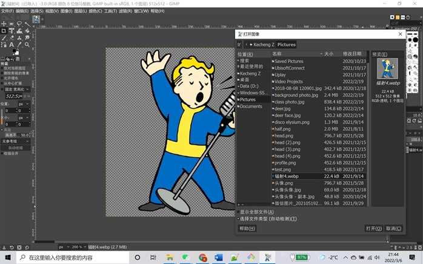  

To me, the most frustrating thing to learn a new software is the initial setting up. Without the key menus, I would be lost on very basic issues, such as "how to draw a line", "why my strokes are colourless", "where to find the colour", etc.  

So, no matter you want to use shapes or painting tools, I found the window name **tool setting** super useful as it shows the properties of the shape or painting tools.  

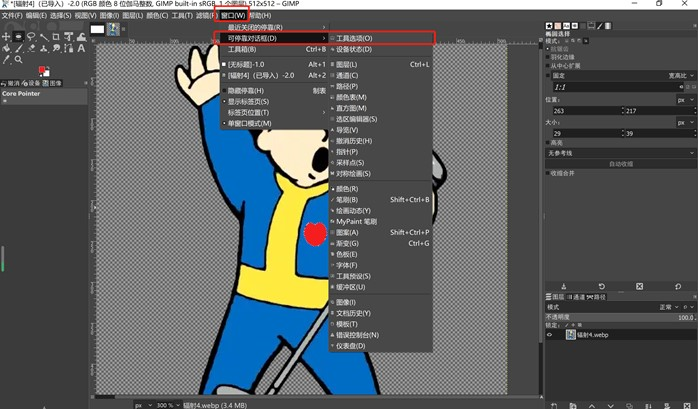  

The menu may show either on the left or the right of the window, but looks like a TV or working board.   

To practise GIMP, I mainly tried the three basic ways of **constraint** to shapes.  

I loaded a vault boy picture from the game Fallout. I wanted to draw a red heart on his chest.  

First, I used **oval** shape to draw an oval.  

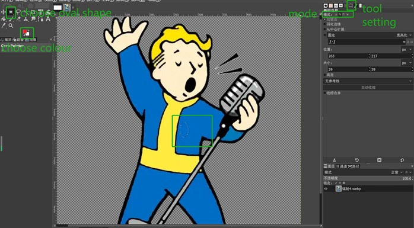  

Then, I drew another oval, with some parts intersected. I chose **combine** mode, so the outlines will be combined to create a new shape.  

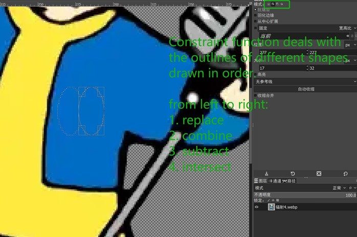  

In fact, the four basic constraint logics are easy to understand, but powerful in design, no matter in 2D raster, vector or 3D models.  

Later, I chose **intersect** mode to draw the third oval which left only the overlapping area. It looked a bit like a frog.  

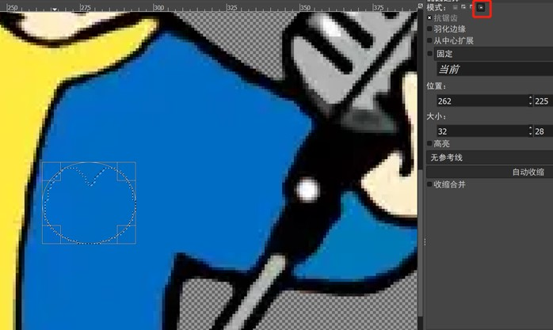  

Well, why not make it into a frog? Remember to press **enter** to finish the drawing.  
  
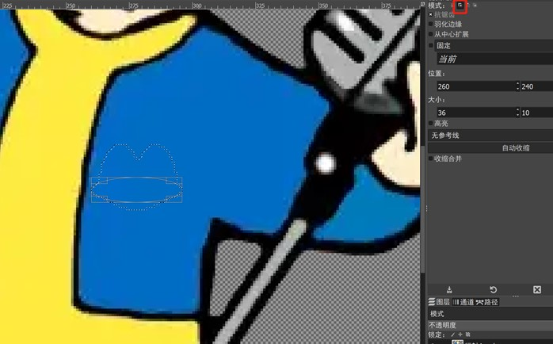  

Finally, I used **paint bucket tool** to paint the shape into red.  

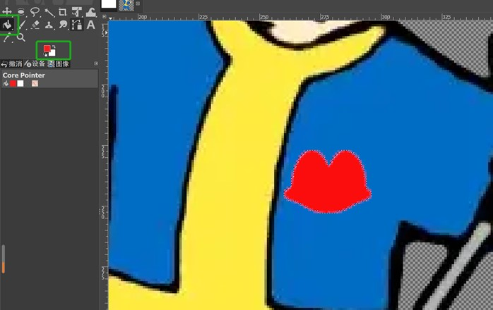  

 
 

### 2. 2D Vector: Inkscape

This is the 2nd pencil draft of the wooden bag for the final project.

As an amateur, I studied thingiverse.com to get inspirations of the wooden box files with their svg files. 

I defined the parts that need modifications such as the flat bottom, interlocking designs, holes to allow the handle, and the trapezoid front-upper side. 

The measurement is crucial in Inkscape design. I got the parameters including slot width and depth.

I used eraser function to weed off the unnecessary parts, then closed the side with a straight line. 

For the residuals, I used white rectangular blocks to cover. 

After the trial, I could focus more on the technical parts for the coming laser cutting: the round corners, the bendable top, etc. So, I used the 3rd pencil draft to help illustrate.

After the modification, I still need to change the line width to 0.02 mm for laser cutting, redesign the trapezoid lines, justify the jigsaw teeth interlocking designs, and take kerf into consideration. 

[The svg file for the practice](../files/inkscape bag modification.svg) 

### 3. 3D Raster and Vector: Fusion360 

I met some problems using Fusion360 during the week mostly because I felt hesitant and scared of new software. I was anxious about the functions or unfamiliar keyboard combinations of Fusion360, just like when I started to programme at CMD, or Inkscape, or generally speaking, anything new including some classic RPGs such as Neverwinter Night, the Elder Scroll, etc. or living in a new country. It is more about personality. So, I tried to dodge Fusion360, but when it came to Behnaz's week for computer-controlled cutting, I must face it as Inkscape is smart except for one thing: parametric design!  
Therefore, I returned to this week's task then located the function of learning Fusion360 as to understand and try parametric designs. After hours of nervous attempt, I practised designing a pentagon with slots. Since this assignment was completed after week 4's content, I had already got the knowledge of kerf, so would directly post the portfolio here.

First, I randomly drew a pentagon under the menu of sketch + create.

Now comes to the parametric design, which Neil, Yrjo, Behnaz as well as numerous vtubers emphasized. The logic is rather simple: Instead of setting parameters by hand for endless times in complicated design, you can just name certain parameters with their expressions (length, angle, etc.). So next time if you change something, click the part + sketch (the radial menu reminds me of the counterpart in Neverwinter Nights). It was chunky at first, but useful after getting used to it. Also, parametric design is powerful as when you constrain certain sides, lengths, angles, and other key parameters, when you change other factors, or feel free to reshape the original design, everything will be automatically and smartly reset which excatly thanks to the parametric restrictions.
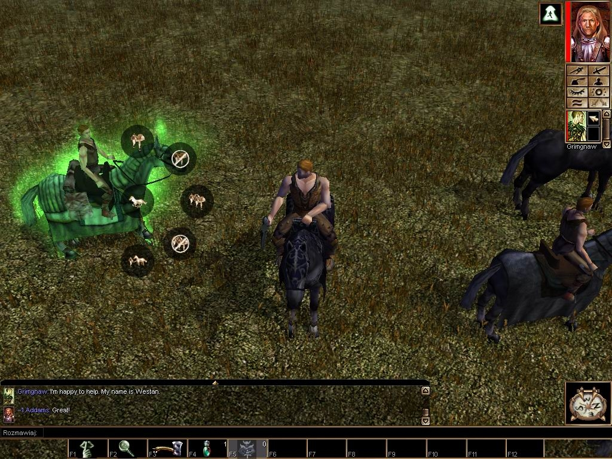

For example, for the pendagon, I named each side as "side". Because in the coming assignment I needed to test laser cutting, I also named a kerf (measured as 0.1mm), the material thickness in 3mm (MDF board), a slot width to be 2.9 mm (=MDF thickness 3mm - 0.1 kerf width). 

(After presentation) Behnaz informed me that parametric design was more about using mathmatic equations to define the parameters, which made me refine the work by changing the slotwidth's expression from typing 2.9mm to "mdfthickness-kerf", instantly I noticed that the value was calculated as 2.9mm. I then changed the expression of "halfside" into "(side-slothwidth)/2" to automatically get 25.05mm in value.  
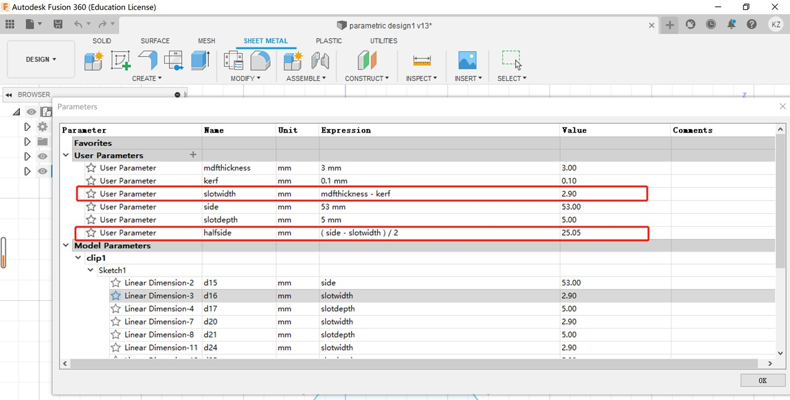
 
(After presentation) As a test, I modified the kerf into 0.3mm, then the other related parameters were immediately reset. 
Now, I understand the logic of parametric design: the name is a label for some parameters (length, angle, etc.); the unit is a measurable unit such as mm, degree, etc. in accordance with the parametric nature; the expression is either a typed number, or mathmatic equation to make related parameters interdepend; the value is the "will be input" value shown on the draft. 
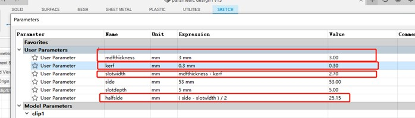

(After presentation) It worked! the "slotwidth" is still 2.9mm, but defined by equations; The "halfside" was also smartly reset:)
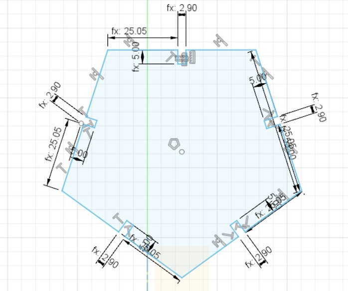

To test the convnience of parametric design, I clicked the sketch function of a pendagon side, directly typed the label "side" instead of a number to change it into 72 mm (originally it was 72.654mm).

Now I immediately got a modified shape with all 5 sizes changed and interconstraint.

Similarly, I drew a rectangle for the slot. Rather than typing numbers, I directly used the parameter names slotdepth (5mm) and slotwidth (2.9mm) to fast set the numbers.

Indeed, it is quite challenging for an absolute beginner like me to memorize the key steps. Thus, I made a brief note of what I often used after watching videos and clicking around. Sketch allows basic line sketches. You can find basic shapes and lines in create column. The modify functions are easy to use. If it is just a 2D design, the curve corner, scissors, offset can help easily make joint shapes.
For example, in my draft, I made a rectangular slot. If I didn't need the overlapping side, the scissors function can delete the extra side. Constraints have smart but powerful functions to align shapes. In my case, I intended to make the longer side of slot perpendicular to the pentagonal side. I just tried the function with 2 trials. If you move the mouse to each icon, there is a brief description to help understand each constraint logic. 

The slot, which consisted of 3 straight lines, can be duplicated so I quickly got 5 same slots for each pentagonal side. The problem arose: How to make the slot perfectly central to each side?

Parametric design worked again. To make the practice easier to calculate, I changed the side expression from 72mm to 53mm, allowing 3mm slotwidth (2.9mm in reality due to the kerf). In this way, there was 25 cm for each side if I centered the slot. I set a new parameter named "halfside" to be 25 mm.

After repeating the sketch, the use of halfside parameter, I got satisfactory pendagon with slots by simply several clicks.

(After presentation) This is the final work with every key parameter being strictly defined by either typed number, or mathmatic equations.  Of course, you can hide the sublines by clicking the eye icon on the left, leaving only the final work you need. 
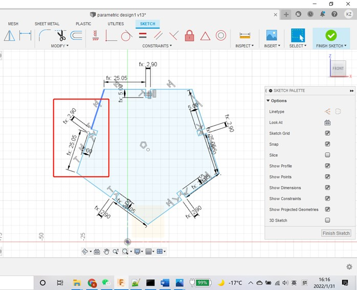

All in all, Fusion360 is a powerful and free software to do parametric design. You can see that the parameters are marked in a clear, concise, and professional way. Chunky as it may be at the first beginning, parametric design saves time and life in complicated designs. For example, if I have an original design of a piece of furniture, I can set 3-5 sizes. If the customers require special parameters, I just need to change the parameters in 10 seconds.

