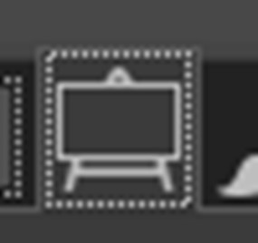

# 3. Computer Aided Design

This week (In the middle of January) Yrjö gave a lecture on computer aided design. I watched Neil's video, wrote the rusty draft, but seriously returned to the documentation on Mar 6, 2022, after 7 weeks of understanding, practice, and digestion of the knowledge through the experience of computer controlled cutting, PCB design, and observations of other people's work.  

To me, it is like using statistics softwares such as SPSS, Stata, and MetLab: Always learn it under real tasks. 

## Research

The 2 key concepts of this week are:  

- **raster** (位图). Raster graphs are made by square **pixel**s. Pixel is the combination of picture and element, or in common language, a dot. Pixels are often measured in **dpi** (dots per inch), and directly affects the resolution of raster graphics, hence is an elementary concept in printing industry. The higher the dpi is, the "clearer" a picture looks like. **.jpeg**, **.gif** are the most common raster files.   

- **vector** (矢量). Unlike pixel-based raster graphs, vector deploys geometric primitives to draw lines and curves which is independent from resolution and is smaller than raster pictures. Even if you zoom in, it looks as "clear" as the originnal size because the lines are always smooth which makes "resolution" basically not a concrete concept. **.ai**, **.svg** are the most commonly used vector files.  
 
Below is a vivid comparison between raster and vector pictures.  

To try the raster and vector designs, I used GIMP for 2D raster, Inkscape for 2D vector, and Fusion360 for 3D models, all of which are new to me.  

Before the course, my humble knowledge for computer aided design was Photoshops. Learning something new is challenging, which is not just about textbook knowledge. Take Fusion360 as an example, it took me around 10 days to get used to their basic functions, during which I regulated my emotion, motivation, as well as the cognitive strategies to learn them. When I gradually get desensitized, I found those professional softwares can be unbelievably convenient once knowing the logic and mechanisms to design really complicated things.  

## Practice + Elaboration

### 1. 2D Raster: GIMP  

GIMP is entirely built by volunteers (of course super professional). When I opened the software, I was immediately attracted by its plain layout as well as user-friendly interfaces.  

  

To me, the most frustrating thing to learn a new software is the initial setting up. Without the key menus, I would be lost on very basic issues, such as "how to draw a line", "why my strokes are colourless", "where to find the colour", etc.  

So, no matter you want to use shapes or painting tools, I found the window name **tool setting** super useful as it shows the properties of the shape or painting tools.  

  

The menu may show either on the left or the right of the window, but looks like a TV or working board.   

To practise GIMP, I mainly tried the three basic ways of **constraint** to shapes.  

I loaded a vault boy picture from the game Fallout. I wanted to draw a red heart on his chest.  

First, I used **oval** shape to draw an oval.  

  

Then, I drew another oval, with some parts intersected. I chose **combine** mode, so the outlines will be combined to create a new shape.  

  

In fact, the four basic constraint logics are easy to understand, but powerful in design, no matter in 2D raster, vector or 3D models.  

Later, I chose **intersect** mode to draw the third oval which left only the overlapping area. It looked a bit like a frog.  

  

Well, why not make it into a frog? Remember to press **enter** to finish the drawing.  
  
  

Finally, I used **paint bucket tool** to paint the shape into red.  

  

I zoomed in to find that the shape I drew was not smooth but was pixel-based. It showed that indeed GIMP is a graphic design software specialized in raster images.  

  
 

### 2. 2D Vector: Inkscape

This is the 2nd pencil draft of the wooden bag for the final project.

As an amateur, I studied thingiverse.com to get inspirations of the wooden box files with their svg files([The original svg file for the practice](../files/simplebox thingiverse.svg) ).  

After comparing with my final design, I defined the parts that need modifications such as the flat bottom, interlocking designs, the holes to allow the handle, and the trapezoid front-upper side.   

The measurement is crucial in Inkscape design. I got the parameters including slot width and depth.

I used eraser function to weed off the unnecessary parts, then closed the side with a straight line. 

For the residuals, I used white rectangular blocks to cover. 

After the trial, I could focus more on the technical parts for the coming laser cutting: the round corners, the bendable top, etc. So, I used the 3rd pencil draft to help illustrate.

After the modification, I still need to change the line width to 0.02 mm for laser cutting, redesign the trapezoid lines, justify the jigsaw teeth interlocking designs, and take kerf into consideration. 
  

One thing I noticed was that Inkscape is indeed a software suitable for vector design. When I zoomed in, the lines are curves were as clear and smooth as the original settings. There was no issue of "resolution".  

[The modified svg file for the practice](../files/inkscape bag modification.svg) 

### 3. 3D Raster and Vector: Fusion360 

I met some problems using Fusion360 during the week mostly because I felt hesitant and scared of new software. I was anxious about the functions or unfamiliar keyboard combinations of Fusion360, just like when I started to programme at CMD, or Inkscape, or generally speaking, anything new including some classic RPGs such as Neverwinter Night, the Elder Scroll, etc. or living in a new country. It is more about personality. So, I tried to dodge Fusion360, but when it came to Behnaz's week for computer-controlled cutting, I must face it as Inkscape is smart except for one thing: parametric design!  
Therefore, I returned to this week's task then located the function of learning Fusion360 as to understand and try parametric designs. After hours of nervous attempt, I practised designing a pentagon with slots. Since this assignment was completed after week 4's content, I had already got the knowledge of kerf, so would directly post the portfolio here.
