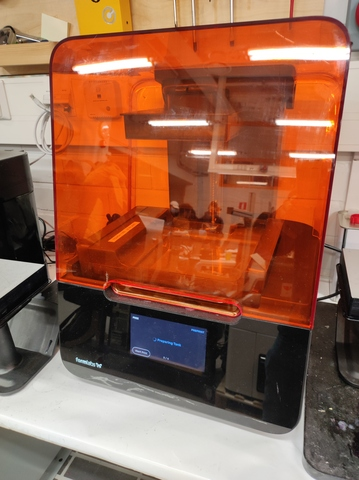

# 6. 3D Scanning and printing

I think most of the students cannot resist the 3D printing skills, just like laser cutting. People can use designing software such as Fusion360 to design, modify 3D objects, then test and produce customised things. In this regard, it is a good example of maker education. 

This week's assignments consisted of group work and individual work. 

## Group Assignment  

For the group work, Behnaz instructed Antti Palosaari and me to inspect 3 different types of 3D printers. The puroose of the team work was to understand the key factors or features by the printers that influence the quality of 3D printing. We used the 3 device with 2 nozzle sizes to look at 8 nozzle filamnets. Antti is a great teammate:)   

The three devices we tested are:  
1. Formlabs Form 3+  
2. Stratasys Fortus 380mc  
3. Raise3D Pro2  

The nozzle sizes:  
1. 0.4mm  
2. 0.8mm  

The 8 filaments (or features) we tested:  
1. overhang  
2. overhang angle  
3. clearance  
4. birdge/span  
5. wall thickness  
6. gap  
7. dimension  
8. surface  

### Pictures of the three 3D printers  

  
  
  

## Individual Assignment

