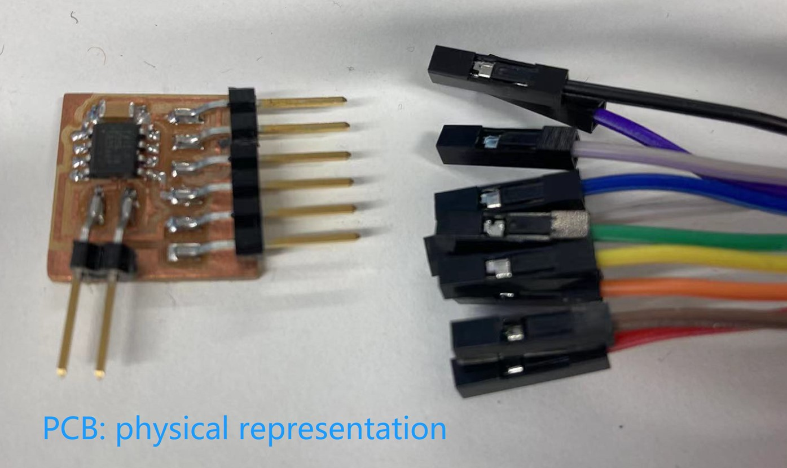
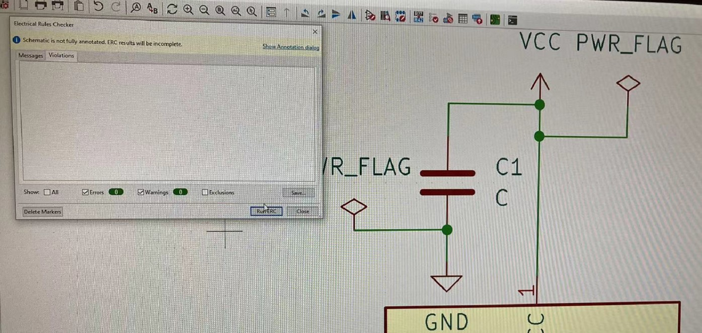
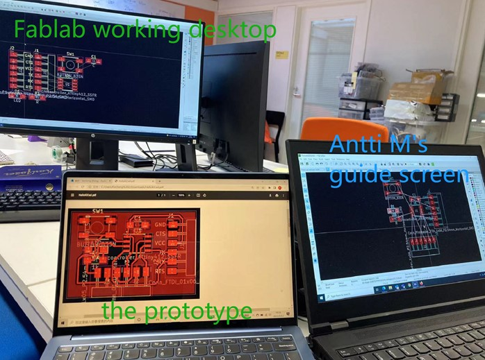

# 9. Embedded programming  

With the basic knowledge of PCB and soldering, this week I continued the electronics courses taught by Antti Mäntyniemi for embedded programming on a STDI chip. The learning objective is to produce a programmed STDI PCB board with an LED controlled by a button. The functions of LED and the button shall be programmmed. I guess this is the foundation for Input design.  

This time the course is a typical engineering style: use a professional software (KiCad) to design the work, then realise it with computer-controlled machine (LPKF ProtoMat S62).  

Based on the prior knowledg of PCB, Antti M used **reverse engineering** to teach. He made me observe a prototype of final PCB work, and guided me to think, disassemble the process of realisation backwards.    

Below is target work of schematic:  
  

as well as the target work of PCB:  
  

## Research

### The use of fablab treasure box  

One of the most important things for independent study is to find the right resources. Antti used the [Fablab course material website](https://academy.cba.mit.edu/classes/) which I found significant as I can find all necessary stuff recognised by Fablab.  

  

### Some basic or updated knowledge  

#### the terms  

- **embedded programming**: to use microcontrollers as the savers for specific programming. For example, the reason why smartphones and electronic devices can be "smart" is that engineers programme certain functions and store them in the microcontrollers (usually known as chips) to allow users to interact.     

- **pin**: the "leg" of electric components.   

- **capacitor**: It can store electrical energy from some resources like battery. The difference is that, batteries store energy chemically, while capacitors realise it physically.  

- **GND**: abbreviation for "ground", which serves to be a common return path for electric current.  

#### The relation between PCB and electronic schematic  

PCB stands for printed circuit board. The board is a physical representation of schematic that can be understood as the "logic" or "soul" of the board. By programming the component functions in schematic, you can define the connections of the pins as well as the workflows of the PCB.   

  

## Procedure

### Use KiCad to set 2 printable files  

For this step, we used **KiCad** as the software to design the schematic.   

  

Below is the interface of Kicad.  

  

#### Set up the KiCad Libraries  

Open a new schematic file.  

An important feature of embedded programming is that you do NOT have to scratch from the surface, but can directly search for the needed items in the digital libraries.  

To realise it, open KiCad. You have to install required libraries (for example: fab contains 17,241 items). Luckily, they have all been properly set in the desktops of Fablab Oulu. 

#### Find proper Items(components)    

The needed items are:  

- microcontroller (Microcontroller_ATtiny412_SSFR)  
- pinheader (Conne_Pinheader_SMD (pinheader is the "needle" while socket is the "receiver"))  
- capacitor (C)  
- LED  
- resistor (R)  
- button (BUTTON_B35N)  

Below are the items in the library:  

  
  
  
  
  

They are shown in the schematic as below:  

  
  
  

Then, add **3 VCC** and **6 GND**.  

  
  

#### Draw lines to link the items   

This steps is to give items electronic connections in a logical flow. To do so, you need to draw lines between different pins.   

Below is the prototype:  

  

This is a quite straightforward step:  

  

It takes patience and focus, but I got the work as below:  

  

#### Tips for debugging   

If you are unsure whether you have properly connected all the pins, don't worry. You can use **Annotate Schematic** to run **Electrical Rules Checker**. It allows you to see if there are some errors related to the schematic design.  

  

For example, when I checked my design, there were 4 errors. The first 2 told me that 2 microcontroller input pins were not driven by output power pins; the latter 2 informed that there were 2 connector pinheaders unconnected.  

  

KiCad smartly marked the problematic pinheads (CTS and RTS).  

  

After justification, I decided not to use the 2 pinheaders then, so found the x on the right to "seal" them. When I run the Electrical Rules Checker again, the 2 pinheader errors were closed.   

  

To solve the microcontroller input/output erros, I added 2 **power flag** item from the library. This item tells ERC where power comes from. In this practice, one PWR flag links to GND, another to VCC.  

  

  

Now, you can see that all the errors were solved.  

  

To do it more professional, you can assign footprints to the key items in your schematic design.  

  

#### Solve the rats' nest PCB puzzle  

The next step is like solving a Lego puzzle. By opening the **PCB Editor**, you will assemble the mock-up components that are ready for later PCB making.  

  

Yeah. At first, it literally IS a mess, which is why another name of it is **the rats' nest**.  

  

To be honest, this step is quite relaxing. I opened my laptop to show the prototype schematic, and dragged the items on my working desktop to their proper places.  

  

#### Add a filled zone to the schematic  

It is meaningful to review the prototype again for absolute beginners (me).  

  

The red part looks bloody, but they are the **copper part** of the PCB. You can see that all the pins are marked with copper rectangles because they really have to.  

First, you need to define an outline of the PCB work. Find **Edge Cuts** in **Appearance** to draw the outline.  

  
 
Then, select **F.CU** to draw the copper paths between pins following the white straight lines that are actually the lines in schematic design.  

  

During this process, I happened to debug the mistakes in the previous step.  

I clicked ?? to see 2 types of errors.  

First, the button (on the left upper corner) was displaced upside down where the 2 GND should have been on the top.  
Second, there are 3 paths unconnected.  

Then, use **??** to draw a slightly inner outline for of the PCB.  

Then, change from mm to **mil** on the left, open **Copper Zone Properties**, click **F.Cu** and select **GND** in the Net. Then, define the **Clearance** and **Minimum width** in Electrical Properties. A moderate number in the practice was 10 mils, but of course you can try other parameters to preview by clicking OK.  

  

After clicking OK, you can see that the PCB is filled with red, copper zone. It gives me an impression that the schematic is a set of skeleton, while PCB editor and filling is to enflesh the design.  

#### Generate gerber files (.gbr)   

Similar to Roland PCB practice, there are 2 gerber files to generate: The outline (Edge_Cuts.gbr)and the inner body (F_Cu.gbr).  

To do so, open **Plot**, click **F.Cu** and **Edge.Cuts** in the **Layers**. Then, choose **plot** to get the 2 files.  

  

### Use ProtoMat S62 to mill it out  

## The files that I used for this assignment:  

prototype schematic and PCB files:

[the referred file](../files/HelloKiCad.pdf)  

my gerber files for PCB:  

[the outline](../files/kechengzhang20200322-Edge_Cuts.gbr)  

[the traces](../files/kechengzhang20200322-F_Cu.gbr)
  

