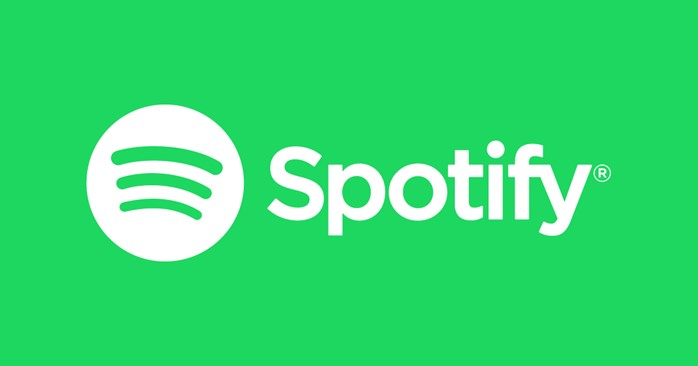

# 19. Invention, intellectual property and income

This week Megumi gave us basic ideas of patent, copyright, intellectual properties, and commercial values of our final projects. She also encouraged us to share our ideas or drafts of the final project, comment and give "3 star 1 wish" suggestions to help each other realize them.  

To me, even the final project may take longer time to achieve due to the changing agenda, it is meaningful to digest Neil's video and Megumi's knowledge in a practical scenario.

## Research on the topic
In Neil's elaboration, pattern refers to inventions of a “matter" as well as the improvements to them. It does not give the inventors an automatic exemption from the being stolen or cheated, but only a name-printed, regional admission ticket into legal system if unfortunate things happen, never to say the expenses that will follow to defend the legal rights. Patent may sound rather professional and rigid, but in fact they must be novel, useful and not obvious. In daily language, those who are fake, cheating, against the principle of nature or human societies will not be acknowledged and hence patented. Below is the patent of a certain type of bike. 

Copyright is to acknowledge the authorship and originality of intellectual works, especially art and academic creations such as books, articles, paintings, musical products. If you own a copyright of a song, you can decide its distribution and usage of the work. For instance, one day I wrote a cheesy song but it suddenly became a hit in China, I could charge for the karaoke bars each time they use my song (of course their business is partially based on the songs). Or I typed a critical essay about Chinese education system. If some media wish to reprint it via website or H5 pages, they must inform me to get approved, or more formally, with inform consent. For example, most artists choose to publish their works in Spotify where users could only listen to the music instantly but cannot download them to have certain "ownership" of the music work.

Trademark is easier to understand. As an institute grows, ther might be more and more products and research. Hence, the trademark is like the "face" of a company, a product, or a design, when showing to the public. For example, Nitendo can use its trademark when doing business with other parties no matther it is about the Switch machine, Super Mario game series, or the cosplay permission of Legend of Zelda.  
 

## How does my project draft look like? 

In the first demo, I hope to realize in MDF board with laser cutter. It is not just because I need to evidence the learning of computer controlled cutting in FabLab, but also I hope to make the bag a bit fun. It can be used as a container not for books or laptop, but for small items or a box of snacks.  

The glittering parts will be installed on left and right sides. I plan to cut some shapes that allow LED lights to be inserted and controlled by an electric sensor.  

I used red lines to mark the challgening parts so far. There will be a joint plate which includes the back, top and upper-top sides. At the same time, I need to think about where to install the handle. If it is on the top, should there be holes to allow the handle to go through? Also, the upper front side should be bigger, presumably a trapezoid with round corners, to cover the front.  

When it comes to lock, I plan to use vintage style: cross-locking. To realize it, I need to cut a small slot and consult the instructors from handicrafts.  

Since the whole bag is a variation of laser cut box with hinge, I need to justify the stability of the jigsaw hinges by tesing different interlocking designs.  
   

## Possible target users
This is literally my first experience in FabLab so there are plenty of rules and information to study and digest, including the final project design. My worklfow was straightforward: Use imagination to combine the freshly acquired engineering and digital fabrication skills with the local society to see where I can start. It does not have to be perfect or so profound as the project can save the world, but it is healthy to make functions public to welcome different comments and suggestions to refine it together in a constructive sense.  

Of course, during the process, the knowledge of intellectual properties including patent, copyright and trademarks, can effectively protect me from being overkind at the beginning, and depressed when infringed.  
 
In this regard, I hope to design a wooden bag used in winter Finland. The users can be any person, but I can start the promotion in among student groups.   

After living here for more than one year, no one would denounce that it is dark from November to January, regardless of the astounding polar lights shining occassionally. I noticed that people are advised to hang glittering items (official name: safety reflector) to their rucksacks to avoid being bumped away by innocent cyclists or car drivers.  

I find the safety reflectors a bit insufficient as they totally rely on the given lights or attention from the coming persons. To deal with it, I hope to make the bag shine by itself.  

## Any plan to start business with the project?
I am not very ambitious in business but it would be very encouraging if someone offers a bid. At least I would have financial incentives to move on. If my bag can be used in local schools, the business is rewarding.

### Types
I would start from the idea of hybrid mode as it allows more perspectives.  

This bag can be first introduced to schools in a non-profitable way. As it is wooden, students can put small items in it and carry like a small lattern walking on the snowy, dark and cold winter lanes. The school budget can of course cover the purchase.  

If students use the bag well, it can be spread to their parents as well as school staff. In this regard, the business can take profit into consideration. The materials of the bag can be flexible with wood, acrylic, or traditional fashion fabrics such as leather and wools. Additional decorations can be customised including the lock, the shape of LED lights, the engraved patterns on the surface. If possible, the bag can try fasion collaborations with big IPs like Moomin. 

### Funding
For this humble design, I hope to start from family and friends' merit funding, say hundreds of euros to do demo test, to cover the transport and canteen fee in school visits, or the coffee bills when persuading neigbors or friends to buy a demo bag. If it can survive after the first year with a quantity demand more than 100, I can learn to expose it to cloud-funding or negotiate purchase commitment with some factories.

## Which copyright licenses will I consider and choose? Why?
Instead of making a decision on which licenses I will choose under the pressure of FabLab weekly assignment and apparently my project is still in the air, I would rather be empty-minded to learn what common licenses are existing.  

I will consider Creative Commons as their license ensure creators to get the recognition and credit for the work they produce. CC also allows the creator to retain copyright while approving others to copy and distribute or to make use of their work non-commercially. What's more, their Chinese webpage is quite user friendly.  
 

 
However, I also like the brief description of Fablab and Neil's frankness: My FB work "may be reproduced, modified, distributed, performed, and displayed for any purpose, but must acknowledge "project name". Copyright is retained and must be preserved. The work is provided as is; no warranty is provided, and users accept all liability."  

# Why not? It's a good platform.  

## How about the patent?
Like I mentioned above, before choosing a patent, or whether to patent something, it is essential to equip myself with the notion, or more practically, the legal significance of patent.  
The protection of IP goes along with progressive education. In China, most people used to have little sense of intellectual properties, assuming that they can use whatever they find from the internet or media. When music companies such as Sony and some famous singers such as Jay Chow forbade people from free downloading, there were huge debates among netizens, some of which blamed them for being so mean and selfish. This misunderstanding has been well solved by education and legal judgements in the last decade.  

After studying Espacenet, Google Patents, and Patent Inspiration, I choose NOT to patent my bag at least for a long term. My initial purpose was to start from students or common folks, which is with strong non-profit feature.I believe the users can help me build up better versions of the bag. In other word, I would rather DONATE it to the society.  

I do have 2 idols who have extraordinarily successful products but have not claimed them to be exclusive:

1. 東方Project／とうほうプロジェクト accompanied my childhood. ZUN, its author, chose to make the whole series including all the elements to be open sources. This worked so well with the fans communities as they worked together to extend the whole project to an unbelievable scale covering cosplay, hobby products, manga, re-creation, etc. which are full of imagination.

2. https://www.irasutoya.com/ The owner of the cute and amazing website has never shown its real face to the public, but has been constantly creating sound illustrations to be publicly used around the world. Some design houses hate it so much due to the fear of unemployment.  

In a serious stance, open sources is a democratic power to fight against monopolies so there must be space for unpatentness. I do not 
believe magnates such as Nitendo, Tencent, or Microsoft whose main incentives are shaped by VCs, can have the patience of interests to make quality games like one of my favorites - Disco Elysium.

